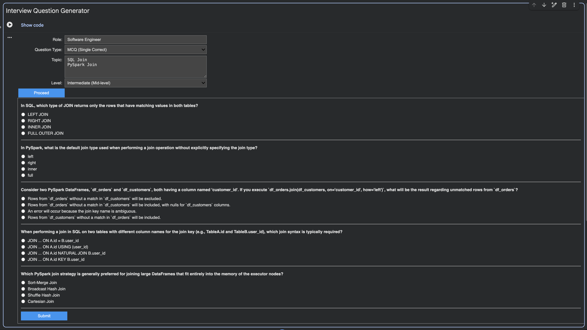
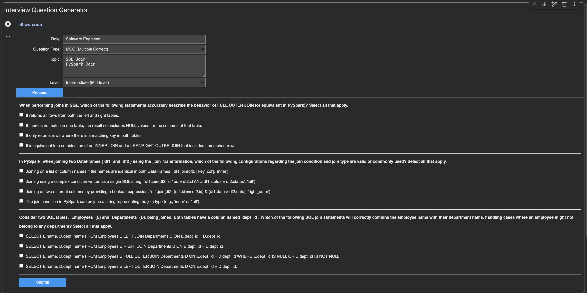
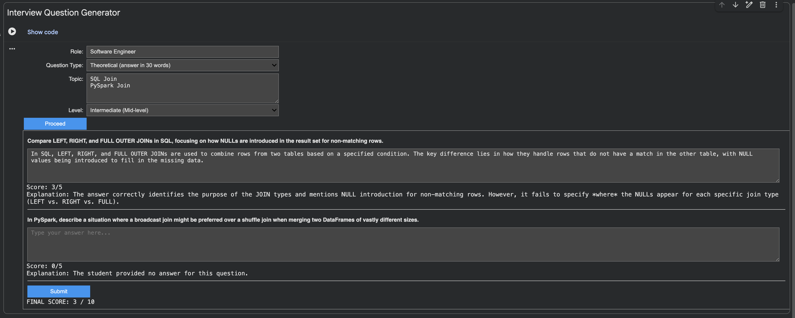
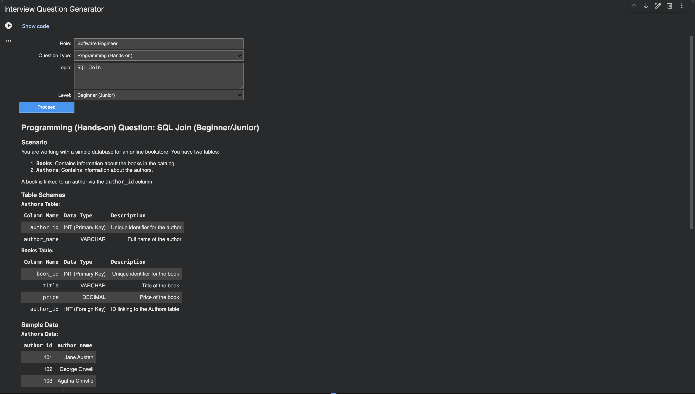

# Interview-Question-Generator

For Software Engineers. 

Questions are generated and evaluated by Gemini APIs.

## Generate 4 kinds of questions.

### 1. MCQ (Single Correct)

### 2. MCQ (Multiple Correct)

### 3. Theoretical (answer in 30 words)

### 4. Programming (Hands-on)

